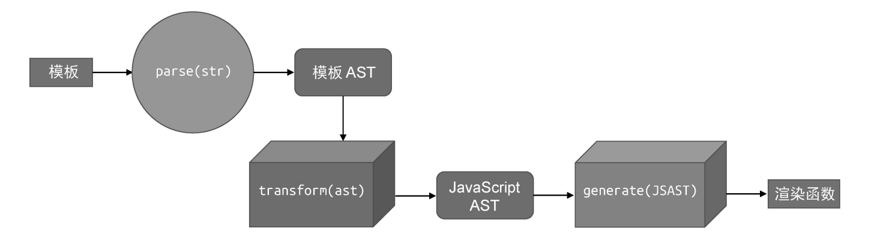

## 将模板编译为渲染函数的过程



1. 模板解析
2. ast转换
3. 代码生成

### parse

```js
// 模板 -> parse(str) -> 模板 AST
const template = `<div id="app">app</div>`
const templateAST = parse(template)
```

### transform
```js
// 模板 AST -> transform(ast) -> JS AST
const jsAST = transform(templateAST)
```

### generate

```js
// jsAST -> generate(ast) -> 渲染函数字符串 (类似这种形式: `function render() {/*...*/}`)
const code = generate(jsAST)
```