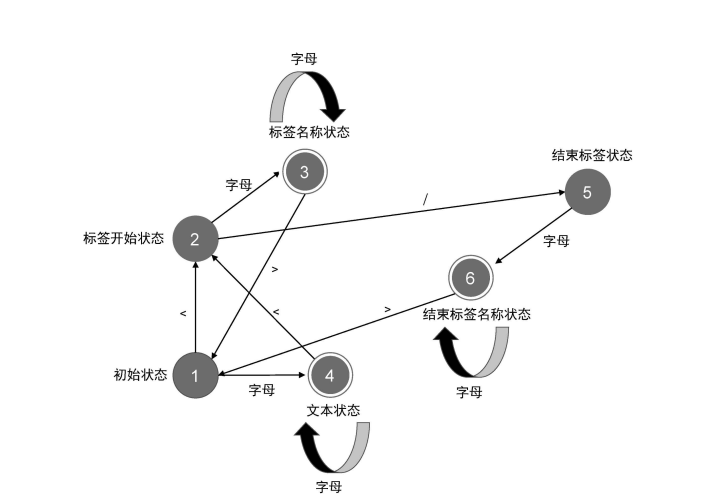

## parser (解析器) 的实现原理和状态机

解析器接收一个字符串模板作为入参，然后逐个读取字符串中的字符，并根据一定的规则将整个字符串切割为一个个 Token

```js
const template = `<p>Vue</p>`
```

解析器会把这段字符串切割为三个 Token: 
- 开始标签：\<p\>
- 文本标签: Vue
- 结束标签：\</p\>

### 有限状态自动机



解析器根据有限状态自动机来对字符串进行切割，在读取字符流的过程中在不同的状态中进行状态转移从而完成对字符串的切割

### 模板标记化 (tokenize)

对模板进行标记化，标记为一个个 <code>Token</code>，具体实现见 <code>./index.js</code>

```js
const template = `<p>Vue</p>`
const tokens = tokenize(template)

console.log(tokens)

// output:
// [
//   { type: 'tag', name: 'p' },
//   { type: 'text', content: 'Vue' },
//   { type: 'tagEnd', name: 'p' },
// ]
```

### 构造 AST 

对 <code>Token</code> 进行解析、构造得到模板 <code>ast</code>

```js
const ast = parse(`<div><p>Vue</p><p>React</p></div>`)
console.log(ast)

// output:
// {
//   type: 'Root',
//   children: [
//     {
//       type: 'Element',
//       tag: 'div',
//       children: [
//         {
//           type: 'Element',
//           tag: 'p',
//           children: [ { type: 'Text', content: 'Vue' } ]
//         },
//         {
//           type: 'Element',
//           tag: 'p',
//           children: [ { type: 'Text', content: 'React' } ]
//         }
//       ]
//     }
//   ]
// }
```

### AST 转换

### 模板 AST => JS AST