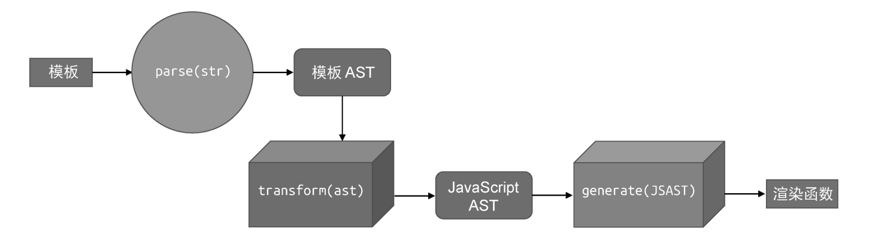

## 将模板编译为渲染函数的过程



1. 模板解析
2. ast转换
3. 代码生成

### parse

```js
// 模板 -> parse(str) -> 模板 AST
const template = `<div id="app">app</div>`
const templateAST = parse(template)
```

### transform
```js
// 模板 AST -> transform(ast) -> JS AST
transform(templateAST)
// JS AST 保存在 templateAST.jsNode 属性上
```

### generate

```js
// jsAST -> generate(ast) -> 渲染函数字符串 (类似这种形式: `function render() {/*...*/}`)
const code = generate(jsAST)
```

### 完整流程

编译：

```js
const template = `<div><p>Vue</p><p>React</p></div>`
const code = compile(template)
console.log(code)
// output:
// function render() {
//     return h('div', [h('p', 'Vue'), h('p', 'React')])
// }

/**
 * 编译
 * @param {String} template 模板
 * @returns {String} 渲染函数字符串代码
 */
function compile(template) {
  // 模板 AST
  const templateAST = parse(template)
  // 将模板 AST 转换为 JS AST
  transform(templateAST)
  // JS AST
  const jsAST = templateAST.jsNode
  // 代码生成
  const code = generate(jsAST.jsNode)

  return code
}
```